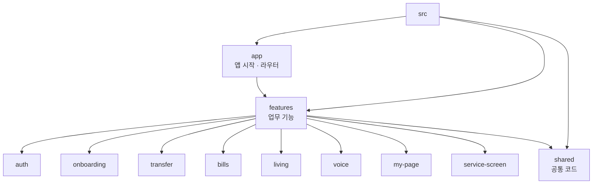

# 프론트엔드 구조 가이드

## 전체 구조

```text
src/
├── app/                  # 앱 시작, 전역 초기화, 라우터
├── shared/               # 기능을 모르는 공통 코드
└── features/             # 사용자 업무 단위 기능
    ├── auth/             # 인증과 세션
    ├── onboarding/       # 회원가입과 권한
    ├── transfer/         # 송금과 예약송금
    ├── bills/            # 고지서 OCR과 납부
    ├── living/           # 알림과 이동점포
    ├── voice/            # STT, TTS, 음성 세션
    ├── my-page/          # 사용자 정보와 설정
    └── service-screen/   # 공통 서비스 화면 조합과 화면 로딩
```

## 기능 폴더 규칙

기능을 수정할 때는 먼저 해당 기능 폴더에서 작업한다.

```text
features/<feature>/
├── pages/       # 라우터가 직접 진입하는 페이지
├── components/  # 해당 기능에서만 재사용하는 UI
├── screens/     # 화면 registry와 화면 reference 데이터
├── stores/      # Pinia 상태와 상태 전이
├── api/         # 해당 기능의 HTTP 요청
├── model/       # 도메인 규칙, 검증, 변환
└── services/    # 저장소, 네이티브 연동 등 부수 효과
```

모든 기능이 모든 하위 폴더를 가져야 하는 것은 아니다. 공통 UI primitive,
Axios client, 네이티브 adapter, 순수 유틸리티처럼 기능을 몰라도 되는 코드는
shared/에 둔다.

## 의존 방향

```text
app → features → shared
pages → components / screens / stores
stores → api / model / services
```

shared/는 기능을 import하지 않는다. 기능 간에 음성 기능이 필요하면 음성 기능의
공개 진입점을 추가하고, 내부 저장소나 네이티브 구현을 직접 참조하지 않는다.

## 화면 키 규칙

라우트와 조건문에는 transfer-confirm, bill-review처럼 의미 있는 screenKey를
사용한다. 2-08, 3-05 같은 기존 디자인 번호는 화면 registry의 designId에만
보존한다. 디자인 파일과 코드의 대응 관계가 필요할 때만 registry를 확인하면
된다.

## 테스트 구조

```text
tests/
├── architecture/  # 구조와 의존 방향 계약
├── app/            # 앱 시작과 전역 라우팅
├── shared/         # 공통 UI, native, 스타일
├── helpers/        # 테스트 공통 helper
└── features/
    ├── onboarding/
    ├── transfer/
    ├── bills/
    ├── my-page/
    └── integration/ # 여러 기능을 잇는 API·라우트·스토어 계약
```

테스트 실행은 scripts/run-tests.mjs가 tests/**/*.test.mjs를 재귀적으로 찾는다.
기존 npm run test:_ prefix 명령도 유지한다.

## Mermaid

전체 구조는 [silvertown-frontend-structure.mmd](../diagrams/silvertown-frontend-structure.mmd),
기능 모듈 내부 규칙은
[silvertown-feature-module-structure.mmd](../diagrams/silvertown-feature-module-structure.mmd)에서
확인할 수 있다.


